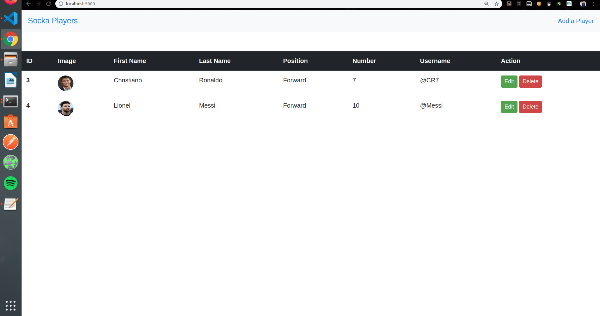

# What is this?
This is a simple web app to demonstrate CRUD functions with the use of NodeJS and mySQL as database. 
You can add, delete, update and view players in the web app. 
I have made this web app with the use of the following:
<ul>
<li><b>Backend : NodeJs</b>
<li><b>Database : SQL (mySQL)</b>
<li><b>Frontend Template Engine : ejs</b>
</ul>

  
# Screenshots 

